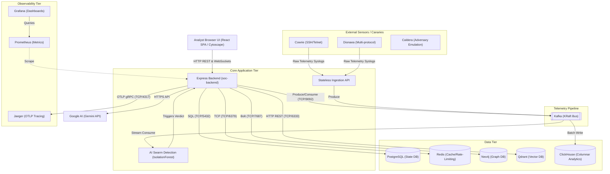

# 📊 EDYSOR - Dependency Graph

This document details the dependency graph and communication vectors of the **EDYSOR** security platform. It maps out how data flows through the application tiers, how services interact, and the critical path for cloud-native orchestration.

---

## 1. Visual Dependency Graph (Mermaid)

---

## 2. Dynamic Pipeline & Telemetry Data Flow

In addition to state-driven REST operations, the telemetry engine processes asynchronous events. The flow typically goes:
1. **Sensors:** External Honeypots (Cowrie, Dionaea) generate Raw Telemetry Syslogs.
2. **Ingestion:** Stateless Ingestion API receives the logs.
3. **Queue:** Data is pushed to the Kafka KRaft Bus.
4. **Processing & Storage:** Kafka streams data to AI Swarm Detection for real-time analysis, while simultaneously batch writing to ClickHouse for columnar analytics.
5. **Action:** The AI Swarm Detection triggers verdicts which are fed back into the Express REST API (State Update).

---

## 3. Dependency Descriptions & Connection Matrix

The table below catalogs connection details, protocol types, and dependency modes for the backend engine:

| Source Service | Target Service | Connection Type | Library Used | Dependency Criticality | Fallback Mechanism |
| :--- | :--- | :--- | :--- | :--- | :--- |
| `soc-frontend` | `soc-backend` | REST (JSON) & WebSockets | Native Fetch / WebSocket | **CRITICAL** | User experiences offline-mode banner; retries connection. |
| `soc-backend` | `postgres` | SQL Queries (TCP/5432) | `pg` (Postgres Client) | **CRITICAL** | Falls back to local SQLite in-memory mock for lightweight environments. |
| `soc-backend` | `redis` | TCP Cache (TCP/6379) | `redis` | **MEDIUM** | Standard in-memory maps inside Node process bypass active rate blocks. |
| `soc-backend` | `neo4j` | Bolt Binary (TCP/7687) | `neo4j-driver` | **LOW** | Bypasses actual graph rendering and serves static mock asset relationships. |
| `soc-backend` | `qdrant` | HTTP REST (TCP/6333) | `@qdrant/js-client-rest` | **LOW** | Stores historical search memories in a local fallback JSON array. |
| `soc-backend` | `kafka` | TCP (TCP/9092) | `kafkajs` (implied) | **HIGH** | Falls back to direct REST ingestion if bus is unavailable. |
| `soc-backend` | `jaeger` | OTLP gRPC (TCP/4317) | `@opentelemetry` | **LOW** | Traces are logged to stdout instead of Jaeger backend. |
| `soc-backend` | `Gemini API` | HTTPS API (External) | `@google/genai` | **HIGH** | Uses deterministic, heuristic analyst rulesets to flag alerts. |

---

## 4. Key Takeaways for Cloud Migration
* **No Stateful Barriers**: The API server is inherently stateless; all critical configurations, user data, and active records reside in external databases (PostgreSQL, Qdrant, Neo4j, ClickHouse). This allows the frontend and backend instances to be deployed in scalable containers (e.g., Google Cloud Run or GKE) behind standard load balancers.
* **Separation of Database Runtimes**: Relational, vector, graph, and columnar databases have completely independent connection drivers. This isolation prevents a failure in one data store (e.g., Qdrant) from impacting the core functionality (PostgreSQL).
